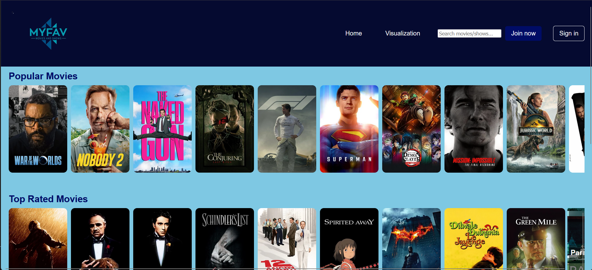
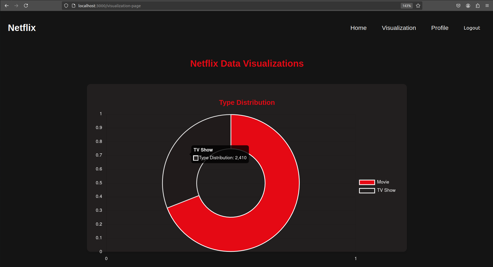

# 🎬 MyFav Movies & Shows Platform

A comprehensive movie and TV show discovery platform built with the MERN stack (MongoDB, Express.js, React, Node.js). This full-stack application provides users with personalized entertainment experiences including user authentication, real-time content browsing, trailer streaming, and advanced data visualization capabilities powered by The Movie Database (TMDB) API.

---

## 🚀 Key Features

- 🔐 **Secure User Authentication** - Complete registration, login, and logout system with JWT-based security
- 🎞️ **Dynamic Content Discovery** - Browse trending movies & TV shows with real-time data from TMDB API
- ▶️ **Integrated Trailer Player** - Seamless YouTube trailer integration with responsive video player
- 📊 **Advanced Data Visualization** - Interactive charts and analytics using Chart.js with real entertainment industry datasets
- 🔍 **Intelligent Search** - Advanced search functionality with filtering for movies and TV shows
- 👤 **Personalized User Profiles** - Individual user dashboards and preferences management
- 📱 **Responsive Design** - Fully optimized for desktop, tablet, and mobile devices
- 🎯 **Performance Optimized** - Efficient API calls, lazy loading, and optimized bundle size

---

## 🏗️ Technical Architecture

### Frontend Technologies
- **React 18+** - Modern functional components with hooks
- **React Router 6** - Client-side routing and navigation  
- **Axios** - HTTP client for API communication
- **Chart.js** - Interactive data visualization
- **Context API** - State management for authentication

### Backend Technologies  
- **Node.js** - Server-side JavaScript runtime
- **Express.js** - Web application framework
- **MongoDB** - NoSQL database with Mongoose ODM
- **JWT** - JSON Web Token authentication
- **CORS** - Cross-Origin Resource Sharing middleware

### External Integrations
- **TMDB API** - The Movie Database for content data
- **YouTube API** - Trailer streaming capabilities
- **CSV Processing** - Entertainment industry dataset analysis

---

## 📁 Project Architecture

```
MYFAV-Movie-shows/
├── backend/                    # Express.js API Server
│   ├── routes/                # API route handlers
│   │   ├── auth.js           # User authentication endpoints
│   │   ├── movies.js         # Movie/TV show data endpoints
│   │   └── users.js          # User profile management
│   ├── models/               # MongoDB data models
│   │   ├── User.js          # User schema definition
│   │   └── Favorite.js      # User favorites schema
│   ├── middleware/          # Custom middleware
│   │   └── auth.js         # JWT authentication middleware
│   ├── utils/              # Utility functions
│   │   └── tmdb.js        # TMDB API integration
│   └── server.js          # Express server configuration
│
├── frontend/                   # React Frontend Application
│   └── src/
│       ├── components/      # Reusable UI components
│       │   ├── Header.js   # Navigation component
│       │   ├── Browse.js   # Content browsing interface  
│       │   ├── VideoPlayer.js # Trailer player component
│       │   └── Visualization.js # Data charts component
│       ├── context/        # React Context providers
│       │   └── AuthContext.js # Authentication state
│       ├── utils/          # Frontend utilities
│       │   └── axios.js    # API client configuration
│       ├── App.js         # Main application component
│       └── index.js       # Application entry point
│
└── assets/                 # Static assets and data
    ├── datasets/          # Entertainment industry data
    └── images/           # Application screenshots
```

---

## 🔧 Installation & Setup

### Prerequisites
- Node.js (v14+ recommended)
- MongoDB (local installation or MongoDB Atlas)
- TMDB API key (free registration at themoviedb.org)

### 🔹 Clone the Repository

```bash
git clone https://github.com/jigs1188/MYFAV_Movie-shows.git
cd MYFAV_Movie-shows
```

### 🔹 Backend Configuration

```bash
cd backend
npm install

# Create environment variables file
touch .env

# Add the following to your .env file:
TMDB_API_KEY=your_tmdb_api_key_here
MONGO_URI=your_mongodb_connection_string
JWT_SECRET=your_jwt_secret_key
PORT=5000

# Start the backend server
npm start
# Server will run on http://localhost:5000
```

### 🔹 Frontend Setup

```bash
cd frontend
npm install

# Start the React development server  
npm start
# Application will open at http://localhost:3000
```

### 🔹 Environment Variables Setup

Create a `.env` file in the backend directory with:

```env
TMDB_API_KEY=your_api_key_from_tmdb
MONGO_URI=mongodb://localhost:27017/myfav-movies
JWT_SECRET=your-super-secret-jwt-key
PORT=5000
NODE_ENV=development
```

---

## 📊 Data Visualization Features

The platform includes comprehensive analytics and visualization capabilities:

- **Content Type Analysis** - Interactive pie charts showing distribution of movies vs TV shows
- **Rating Distribution** - Bar charts displaying content ratings and audience preferences  
- **Release Timeline** - Line graphs tracking content release patterns over time
- **Genre Popularity** - Visual breakdown of most popular entertainment genres
- **Performance Metrics** - Real-time dashboard with user engagement statistics

Navigate to `/visualization-page` to explore the interactive analytics dashboard built with Chart.js and real entertainment industry datasets.

---

## 🔍 Advanced Search & Discovery

The platform features sophisticated search capabilities:

- **Intelligent Filtering** - Smart search that automatically filters movies and TV shows
- **Real-time Results** - Instant search results as you type
- **TMDB Integration** - Comprehensive database with detailed movie/show information
- **Category Filtering** - Browse by genre, release year, rating, and popularity
- **Responsive Design** - Optimized search interface for all device sizes

The search functionality is integrated into the main navigation and provides comprehensive results from The Movie Database API.

---

## 🎯 Development Highlights

### Technical Achievements
- **Full-Stack Development** - Complete MERN stack implementation from database to UI
- **RESTful API Design** - Clean, scalable API architecture with proper HTTP methods
- **Authentication & Security** - JWT-based authentication with protected routes
- **External API Integration** - Efficient integration with TMDB API for real-time data
- **Data Visualization** - Interactive charts and analytics using Chart.js
- **Responsive Design** - Mobile-first approach with CSS Grid and Flexbox
- **State Management** - React Context API for global application state

### Performance Optimizations
- Lazy loading for improved initial page load times
- Debounced search to reduce API calls
- Image optimization and responsive loading
- Efficient data caching strategies
- Minified production builds

### Code Quality Features
- Modular component architecture
- Separation of concerns between frontend and backend
- Error handling and user feedback systems
- Clean, maintainable code structure
- Environment-based configuration management

## 📸 Application Screenshots


*Main dashboard with trending content and personalized recommendations*

/*
*Interactive analytics dashboard with entertainment industry insights* */

---

## 🚀 Deployment & Production

### Recommended Hosting Platforms

**Backend API Deployment:**
- [Render](https://render.com) - Free tier available with automatic deploys
- [Railway](https://railway.app) - Modern deployment platform
- [Heroku](https://heroku.com) - Enterprise-grade hosting

**Frontend Deployment:**  
- [Vercel](https://vercel.com) - Optimized for React applications
- [Netlify](https://netlify.com) - Continuous deployment from Git
- [Firebase Hosting](https://firebase.google.com/products/hosting) - Google Cloud integration

**Database Hosting:**
- [MongoDB Atlas](https://www.mongodb.com/cloud/atlas) - Managed MongoDB service
- [Railway PostgreSQL](https://railway.app) - Alternative database option

### Production Environment Variables

```env
NODE_ENV=production
TMDB_API_KEY=your_production_api_key
MONGO_URI=your_production_mongodb_uri
JWT_SECRET=your_secure_production_jwt_secret
FRONTEND_URL=https://your-frontend-domain.com
```

### Live Demo
🌐 **[View Live Application](https://net-flix-clone-1t477722k-jigneshs-projects-25e43af9.vercel.app/)**

---

## 👨‍💻 Developer

**Jignesh Parmar**  
Full-Stack Developer | MERN Stack Specialist

🔗 **Connect with me:**
- 💼 GitHub: [@jigs1188](https://github.com/jigs1188)
- 💼 LinkedIn: [Connect on LinkedIn](https://linkedin.com/in/jigs1188)
- 📧 Email: Available upon request

---

## 🛠️ Future Enhancements

- [ ] User favorites and watchlist functionality
- [ ] Recommendation system based on user preferences  
- [ ] Social features - reviews and ratings
- [ ] Advanced filtering and sorting options
- [ ] PWA (Progressive Web App) capabilities
- [ ] Real-time notifications for new content
- [ ] Multi-language support

---

## 📄 License

This project is licensed under the MIT License - see the [LICENSE](LICENSE) file for details.

**MIT License © 2025 Jignesh Parmar**

---

## 🙏 Acknowledgments

- [The Movie Database (TMDB)](https://www.themoviedb.org/) for providing comprehensive movie and TV show data
- [Chart.js](https://www.chartjs.org/) for excellent data visualization capabilities
- [React](https://reactjs.org/) community for continuous innovation and support
- Entertainment industry datasets used for analytics and insights

---

*Built with ❤️ using the MERN stack*

